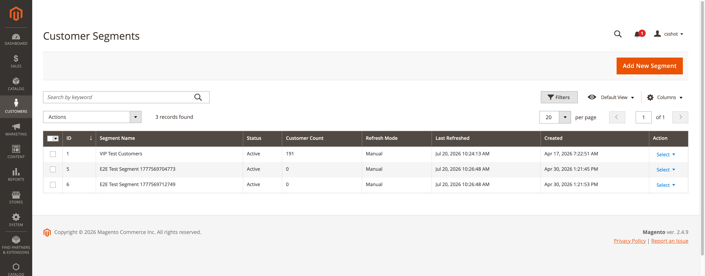
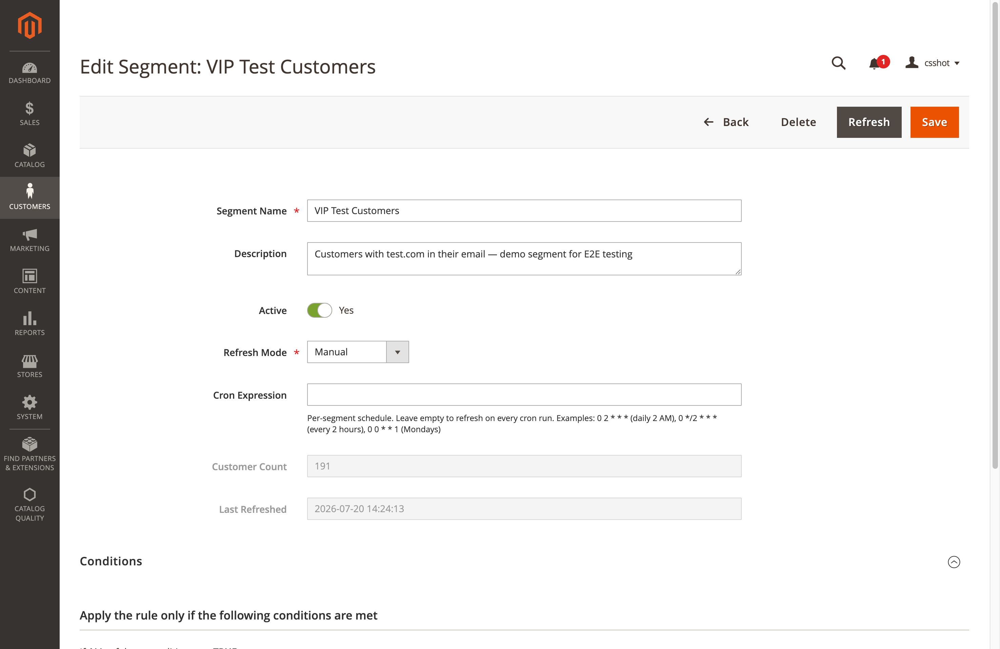

# Magendoo CustomerSegment for Magento 2

A comprehensive Customer Segmentation module for Magento 2 Community Edition that enables merchants to create dynamic customer segments based on various criteria including customer attributes, order history, shopping cart data, and behavior patterns.

## Screenshots

### Segment Grid — manage all your customer segments at a glance



### Segment Editor — visual rule builder with conditions and customer matching



## Documentation

| Document | Description |
|----------|-------------|
| [User Guide](docs/USER_GUIDE.md) | End-user documentation for managing segments |
| [Developer Documentation](docs/DEVELOPER.md) | Technical documentation for developers |
| [API Documentation](docs/API_DOCUMENTATION.md) | REST API reference and examples |
| [Testing Guide](TESTING.md) | Unit testing patterns and best practices |
| [Changelog](CHANGELOG.md) | Version history and changes |

## Features

### Customer Segmentation
- **Dynamic Segments**: Automatically assign customers based on rules
- **Manual Segments**: Static customer assignments
- **Real-time Updates**: Refresh segments on customer events
- **Scheduled Updates**: Cron-based segment refresh

### Condition Types

#### Customer Attributes
- Email, First Name, Last Name
- Date of Birth, Gender
- Tax/VAT Number
- Website, Store View, Customer Group
- Account Creation Date

#### Order History
- Total Orders Count
- Total Revenue / Average Order Value
- First/Last Order Date
- Total Items Purchased
- Used Coupon Codes
- Payment/Shipping Methods
- Shipping Countries
- Order Status

#### Shopping Cart
- Cart Subtotal
- Cart Items Count
- Contains Products (by SKU)
- Has Active Cart
- Days Since Cart Activity

#### Product Interactions
- Purchased Products (SKU)
- Purchased from Categories
- Wishlist Items Count

> Viewed-categories (product-view) segmentation is on the [roadmap](CHANGELOG.md#roadmap-not-yet-implemented) and not yet available.

### Admin Features
- Grid view of all segments with customer counts
- Create/Edit segments with visual rule builder
- Preview matching customers before saving
- "Matched Customers" tab on edit page shows assigned customers
- Refresh button on edit page
- Mass actions (Delete, Refresh)
- Export segment customers (CSV/XML)

### API & Integrations
- REST API for segment management
- CLI commands for segment operations
- Integration with Cart Price Rules
- Segment indexer with mview support

## Installation

### Via Composer (Recommended)

This package is not on Packagist yet, so register the repository first:

```bash
composer config repositories.magendoo-customer-segment vcs https://github.com/florinel-chis/magendoo-m2-customersegment
composer require magendoo/module-customer-segment
bin/magento setup:upgrade
bin/magento setup:di:compile
bin/magento setup:static-content:deploy -f
bin/magento cache:flush
```

### Manual Installation

1. Extract files to `app/code/Magendoo/CustomerSegment/`
2. Run the following commands:

```bash
bin/magento setup:upgrade
bin/magento setup:di:compile
bin/magento setup:static-content:deploy -f
bin/magento cache:flush
```

## Configuration

- **Segment grid** (create/edit/refresh segments): **Customers → Customer Segments**
- **Module settings** (enable/disable, default refresh mode, cron schedule):
  **Stores → Configuration → Customers → Customer Segments**

## Usage

### Creating a Segment

1. Navigate to **Customers → Customer Segments**
2. Click **"Add New Segment"**
3. Fill in the general information:
   - Name (required)
   - Description (optional)
   - Status (Active/Inactive)
   - Refresh Mode (Manual/Cron/Real-time)
4. Configure conditions in the **Conditions** tab
5. Save the segment
6. Click **"Refresh Segment Data"** to populate customers

### Segment Refresh Modes

| Mode | Description |
|------|-------------|
| **Manual** | Admin must click refresh button to update |
| **Cron** | Updated automatically on cron schedule (default: `*/5 * * * *`, every 5 minutes) |
| **Real-time** | Updated on customer events (register, save, login, order, quote merge) |

### CLI Commands

```bash
# Refresh specific segment(s)
bin/magento magendoo:customer-segment:refresh 1
bin/magento magendoo:customer-segment:refresh 1 2 3

# Refresh all active segments
bin/magento magendoo:customer-segment:refresh --all

# Export segment customers
bin/magento magendoo:customer-segment:refresh 1 --export --format=csv
```

### Using Segments in Cart Price Rules

1. Go to **Marketing → Cart Price Rules**
2. Create or edit a rule
3. In the **Conditions** section, add condition:
   - **Customer Segment** → **is** → *[Select your segment]*
4. Save the rule

## API Reference

### REST API Endpoints

| Method | Endpoint | Description |
|--------|----------|-------------|
| GET | `/V1/customer-segments` | List all segments |
| GET | `/V1/customer-segments/:segmentId` | Get segment by ID |
| POST | `/V1/customer-segments` | Create new segment |
| PUT | `/V1/customer-segments/:segmentId` | Update segment (partial updates merge onto the stored record) |
| DELETE | `/V1/customer-segments/:segmentId` | Delete segment |
| POST | `/V1/customer-segments/:segmentId/refresh` | Refresh a single segment; returns the assigned count |
| POST | `/V1/customer-segments/refresh-all` | Refresh all active segments |
| GET | `/V1/customers/:customerId/segments` | Get the customer's segments |
| GET | `/V1/customers/:customerId/segment-ids` | Get the customer's segment IDs |
| GET | `/V1/customers/:customerId/segments/:segmentId/check` | Check if a customer is in a segment |
| GET | `/V1/customer-segments/:segmentId/customers?format=csv\|xml` | Export a segment's customers; `format` is required and returns a CSV or XML string |

### Example: Create Segment via API

```bash
curl -X POST "https://your-store.com/rest/V1/customer-segments" \
  -H "Content-Type: application/json" \
  -H "Authorization: Bearer YOUR_TOKEN" \
  -d '{
    "segment": {
      "name": "VIP Customers",
      "description": "Customers with 10+ orders",
      "is_active": true,
      "refresh_mode": "cron",
      "conditions_serialized": "{...}"
    }
  }'
```

## Database Structure

### Tables

| Table | Description |
|-------|-------------|
| `magendoo_customer_segment` | Stores segment definitions |
| `magendoo_customer_segment_customer` | Customer-segment relationships |
| `magendoo_customer_segment_log` | Segment activity log (save/refresh actions) |

## Events

The module dispatches the following events:

| Event | Payload keys | Description |
|-------|--------------|-------------|
| `magendoo_customersegment_segment_save_before` | `segment` | Before a segment model is saved |
| `magendoo_customersegment_segment_save_after` | `segment` | After a segment model is saved |
| `magendoo_customersegment_refresh_before` | `segment`, `segment_id` | Before a segment refresh |
| `magendoo_customersegment_refresh_after` | `segment`, `segment_id`, `assigned_customers`, `assigned_count` | After a segment refresh |
| `magendoo_customersegment_customer_assigned` | `customer_id`, `segment_id` | Customer assigned to a segment |
| `magendoo_customersegment_customer_removed` | `customer_id`, `segment_id` | Customer removed from a segment |
| `magendoo_customersegment_conditions` | `additional` | Register custom condition types |

## Extension Points

### Adding Custom Conditions

Create a plugin to add custom conditions:

```php
class AddCustomConditionPlugin
{
    public function afterGetNewChildSelectOptions($subject, $result)
    {
        $result[] = [
            'label' => __('My Custom Condition'),
            'value' => 'Vendor\Module\Model\Condition\MyCondition'
        ];
        return $result;
    }
}
```

## Troubleshooting

### Segments not refreshing
1. Check if the segment is Active
2. Verify cron is running: `bin/magento cron:run`
3. Check logs at `var/log/system.log`

### Customers not matching
1. Verify condition logic
2. Check that customer data exists
3. Test with CLI: `bin/magento magendoo:customer-segment:refresh --all`

### Performance issues
1. Prefer conditions that resolve set-based (a single query) over ones that fall back to per-customer validation
2. Use Manual or Cron refresh mode for large segments rather than Real-time
3. Schedule cron refresh during low-traffic hours

## Testing

### Running Tests

```bash
# Run all module tests
vendor/bin/phpunit --filter Magendoo app/code/Magendoo/CustomerSegment/Test/Unit

# Run specific test class
vendor/bin/phpunit --filter SegmentManagementTest app/code/Magendoo/CustomerSegment/Test/Unit/Model/SegmentManagementTest.php

# Run with coverage
vendor/bin/phpunit --filter Magendoo --coverage-html coverage app/code/Magendoo/CustomerSegment/Test/Unit
```

### Test Coverage

<!-- TODO: refresh exact test/assertion counts after the PHPUnit 12 test migration. -->

The unit suite covers `SegmentManagement` and every condition type (`Combine`, `Customer`, `Order`,
`Cart`, `Product`) plus set-based matching. Tests target PHPUnit 12.

### Security Tested

- ✅ CSV export neutralizes leading formula characters (`=`, `+`, `-`, `@`, tab, CR) to prevent spreadsheet formula injection
- ✅ Condition type allowlist prevents arbitrary class instantiation

See [TESTING.md](TESTING.md) for detailed testing documentation.

## Support

For support and questions:
- Email: info@magendoo.ro


## License

This module is licensed under the MIT License. See [LICENSE](LICENSE) for details.

## Credits

Developed by Magendoo (https://magendoo.ro)

---

**Version**: 2.0.0  
**Compatibility**: Magento 2.4.x  
**PHP Version**: 8.1+
